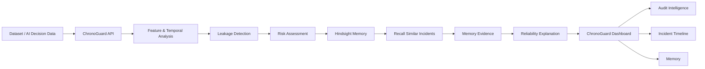

<div align="center">

# ⚡ ChronoGuard

### **AI Reliability Engineer with Hindsight Memory**

**Detect → Remember → Explain → Learn**

> **ChronoGuard detects data leakage and reliability risks in AI/ML decision systems, then uses Hindsight memory to connect current failures with previously observed incidents.**


<br/>


</div>

---

## ✨ The Idea in One Line

<div align="center">

### 🧠 **Give AI reliability systems a memory of what went wrong before.**

</div>

---

## 🎯 Problem

AI/ML systems can produce impressive results while quietly depending on information that would **not be available at real prediction time**.

This creates problems such as:

- 🚨 **Data leakage**
- ⏱️ **Future-information leakage**
- 📉 **Unreliable model evaluation**
- 🔍 Difficult root-cause analysis
- 🧠 Loss of knowledge from previous incidents

Traditional validation can identify a suspicious feature, but the reliability team still needs to understand:

**“Have we seen this kind of failure before?”**

---

## 💡 Solution

**ChronoGuard** is an AI reliability system designed to detect suspicious features and investigate whether they contain information that would only become available after the prediction point.

Instead of treating every incident as a new problem, ChronoGuard uses **Hindsight memory** to connect the current finding with previous reliability incidents.

### The core idea

**Detect → Remember → Recall → Explain → Learn**

---

## 🧠 Why Hindsight Memory?

A reliability system should not only detect failures.

It should also **remember what happened before**.

ChronoGuard stores important reliability incidents and retrieves relevant historical evidence when a new audit is performed.

This enables the system to answer questions such as:

- What similar leakage was detected previously?
- Which feature caused the earlier problem?
- How similar is the current incident?
- What evidence should an engineer investigate?
- What patterns are repeating across audits?

### 🔄 Retain → Recall → Reflect

| Memory Stage | ChronoGuard |
|---|---|
| 📝 **Retain** | Store important reliability incidents |
| 🔎 **Recall** | Retrieve relevant historical incidents |
| 🧠 **Reflect** | Use previous evidence to explain the current finding |

---

## 🏗️ Architecture



---

## 🔍 How ChronoGuard Works

### 1️⃣ Analyze

ChronoGuard receives decision data and examines the available features.

### 2️⃣ Detect

The system looks for suspicious relationships between features, outcomes, and the prediction timeline.

### 3️⃣ Identify Leakage

Features that contain information unavailable at prediction time can be flagged as potential leakage.

### 4️⃣ Assess Risk

The detected issue is converted into a reliability risk assessment.

### 5️⃣ Recall Memory

ChronoGuard searches Hindsight for previously stored reliability incidents that are relevant to the current finding.

### 6️⃣ Explain

Historical memory provides additional evidence that helps engineers understand the current incident.

### 7️⃣ Retain

Important incidents can become part of the system's reliability memory for future investigations.

---

## 📊 Demo Results

The current ChronoGuard demo demonstrates the reliability workflow using a predictive-maintenance dataset.

### ⚡ Current Demo

| Metric | Result |
|---|---:|
| Decisions analyzed | **500** |
| Features inspected | **6** |
| Leaked features | **1 / 6** |
| Affected decisions | **500 / 500** |
| Affected rate | **100%** |
| Risk score | **83 / 100** |
| Stored memory incidents | **6** |
| Memory system | **Hindsight enabled** |

### 🚨 Detected Issue

The feature:

```text
maintenance_failure_confirmation
```

was identified as a suspicious post-outcome signal.

The demo shows how ChronoGuard can connect the current reliability finding with previous incidents through memory.

---

## ⚡ Key Features

### 🔎 AI Reliability Audit
Analyze decision datasets for suspicious feature relationships and potential leakage.

### 🚨 Leakage Detection
Identify features that may contain information unavailable at prediction time.

### 📊 Risk Assessment
Convert detected reliability problems into an understandable risk score.

### 🧠 Hindsight Memory
Store and retrieve historical reliability incidents.

### 🔗 Memory Evidence
Connect current findings with previous incidents that provide relevant evidence.

### 🕒 Incident Timeline
Present reliability events as a timeline so engineers can understand how incidents evolved.

### 🧩 Audit Intelligence
Bring detection, evidence, risk, and historical memory together in one workflow.

---

## 🖥️ Product Flow

```text
Dataset
   ↓
Audit
   ↓
Feature Analysis
   ↓
Leakage Detection
   ↓
Risk Assessment
   ↓
Hindsight Recall
   ↓
Historical Evidence
   ↓
Reliability Explanation
   ↓
Retain New Incident
```

---

## 🛠️ Tech Stack

### Frontend
- React
- TypeScript
- Vite
- Tailwind CSS

### Backend
- Python
- FastAPI
- Uvicorn
- Pydantic
- SQLAlchemy

### Data & ML
- Pandas
- NumPy
- Scikit-learn

### AI & Memory
- Hindsight Memory
- OpenAI integration
- Local vector-based support

### Deployment
- Render

---

## 🚀 Quick Start

### 1. Clone the repository

```bash
git clone https://github.com/Lokesh1430/chronoguard.git
cd chronoguard
```

### 2. Start the backend

```bash
cd backend
pip install -r requirements.txt
uvicorn main:app --reload
```

Backend:

```text
http://localhost:8000
```

Health check:

```text
http://localhost:8000/api/health
```

### 3. Start the frontend

```bash
cd frontend
npm install
npm run dev
```

Frontend:

```text
http://localhost:5173
```

---

## 🌐 Live Deployment

### Frontend

https://chronoguard-2.onrender.com

https://chronoguard-ochre.vercel.app/

### Backend

https://chronoguard-1.onrender.com

### API Health

https://chronoguard-1.onrender.com/api/health

---

## 🔌 Key API

| Endpoint | Purpose |
|---|---|
| `GET /api/health` | Check backend health |
| `POST /api/audits` | Create an audit |
| `GET /api/audits/{id}` | Retrieve audit information |
| `GET /api/audits/{id}/replay` | Replay audit information |
| `POST /api/memory/search` | Search reliability memory |
| `GET /api/memory/graph` | Retrieve memory relationships |
| `GET /api/memory/timeline` | Retrieve memory timeline |
| `GET /api/hindsight/status` | Check Hindsight status |
| `POST /api/hindsight/recall` | Recall relevant memory |
| `POST /api/hindsight/reflect` | Generate memory-based reflection |

> API availability can depend on the deployed backend version.

---

## 🧠 Memory Design

ChronoGuard treats reliability incidents as reusable knowledge.

A stored incident can contain information such as:

```text
Incident
├── Dataset / audit context
├── Suspicious feature
├── Leakage evidence
├── Risk information
├── Temporal relationship
└── Historical similarity
```

When a new audit is performed:

```text
Current Incident
      ↓
Hindsight Recall
      ↓
Similar Historical Evidence
      ↓
Contextual Explanation
```

This transforms memory from simple storage into a reliability feedback loop.

---

## ⚠️ Current Limitations

- Reliability findings depend on the quality and structure of the supplied data.
- Automated leakage detection should be treated as an engineering signal requiring human validation.
- Production deployment would require stronger persistence, authentication, monitoring, and operational controls.

---

## 🗺️ Future Improvements

- 🔐 Production-grade authentication and access control
- 🗄️ Persistent production database
- 📈 More advanced temporal leakage detection
- 🤖 More automated root-cause analysis
- 🧠 Deeper historical incident reasoning
- 📊 Expanded reliability analytics
- 🔔 Automated reliability alerts
- 🔄 Continuous model/data monitoring

---

## 🏆 Highlights

<div align="center">

| 🔎 Detect | 🧠 Remember | 💡 Explain | 🔄 Learn |
|:---:|:---:|:---:|:---:|
| Find reliability risks | Recall past incidents | Connect evidence | Improve future audits |

</div>

### ⭐ What makes ChronoGuard different?

**Traditional approach**

```text
Detect a problem
      ↓
Fix the problem
      ↓
Move on
```

**ChronoGuard approach**

```text
Detect
  ↓
Remember
  ↓
Recall
  ↓
Compare
  ↓
Explain
  ↓
Learn
  ↓
Improve future reliability
```

### 🚀 Core Value

> **ChronoGuard gives AI reliability systems a memory of what went wrong before.**

It combines **data-leakage detection, risk assessment, and Hindsight-powered historical reasoning** into one reliability workflow.

---

## 🎬 The ChronoGuard Loop

<div align="center">


</div>

```text
                 ┌───────────────────┐
                 │   AI / ML Data    │
                 └─────────┬─────────┘
                           ↓
                  🔎 DETECT LEAKAGE
                           ↓
                    🚨 RISK SIGNAL
                           ↓
                   🧠 RECALL MEMORY
                           ↓
                    🔗 PAST EVIDENCE
                           ↓
                    💡 EXPLAIN RISK
                           ↓
                    📝 RETAIN INCIDENT
                           ↺
                  Continuous Learning
```

---

## 📌 Project Summary

**ChronoGuard** is an AI Reliability Engineer with Hindsight Memory.

It is designed to help engineers:

- 🔎 Detect potential data leakage
- 🚨 Identify reliability risks
- 🧠 Remember previous incidents
- 🔗 Recall similar historical evidence
- 💡 Understand why a current finding matters
- 🔄 Build a continuous reliability learning loop

---

## 🔗 Links

- 🌐 **Live Demo:** https://chronoguard-ochre.vercel.app/
- 💻 **GitHub:** https://github.com/Lokesh1430/chronoguard
- ❤️ **Hindsight:** https://hindsight.vectorize.io/

<div align="center">

`⚡ AI Reliability` &nbsp;•&nbsp; `🧠 Hindsight Memory` &nbsp;•&nbsp; `🔎 Leakage Detection` &nbsp;•&nbsp; `🚨 Risk Analysis`

</div>

---

<div align="center">


</div>
